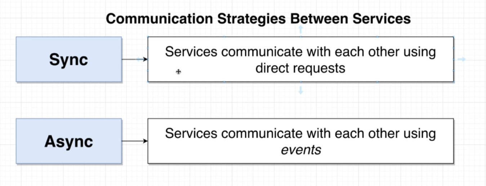

# Microservices

It is a event based streaming architecture

- Each service gets its own database and this pattern is called Database-Per-Service
- A service cannot directly interact with the database of another service
  
## Challenges with Micro Services

- Data management between services: The way we store data inside a service and how we communicate that data between
  different services

## Communication Strategies between Services

- Sync: services communicate with each other using direct requests (not with the db)
- Async: services communicate with each other using events

