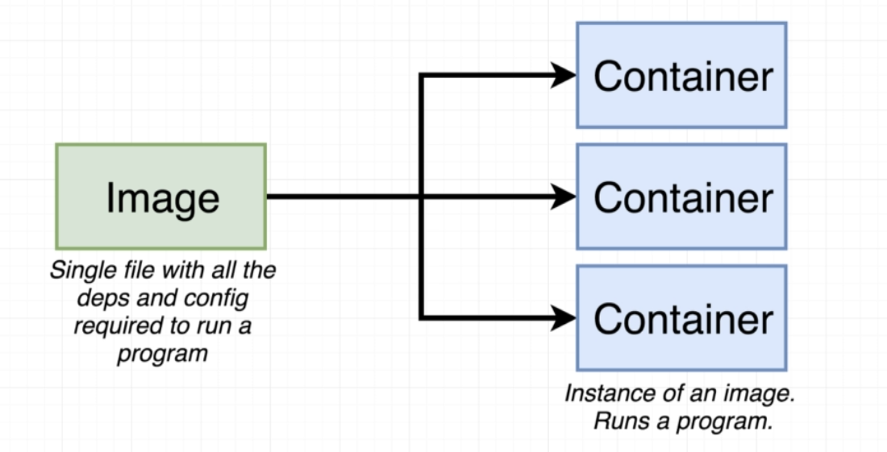
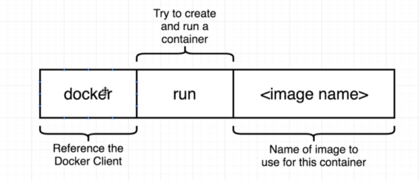
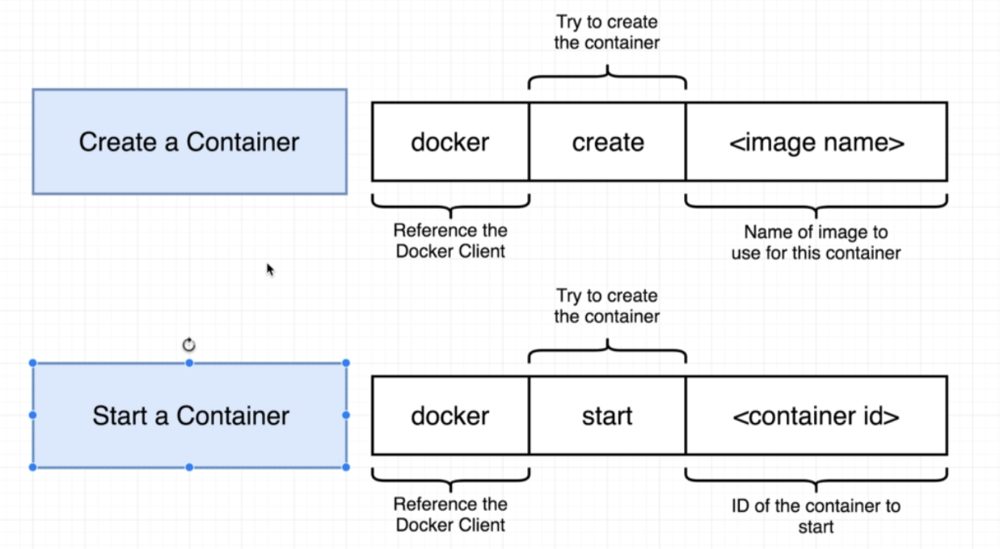
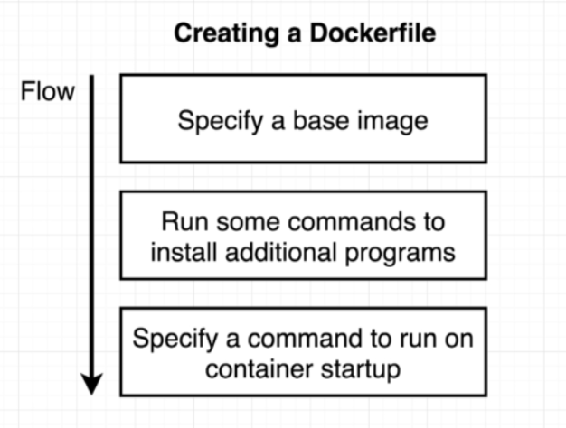
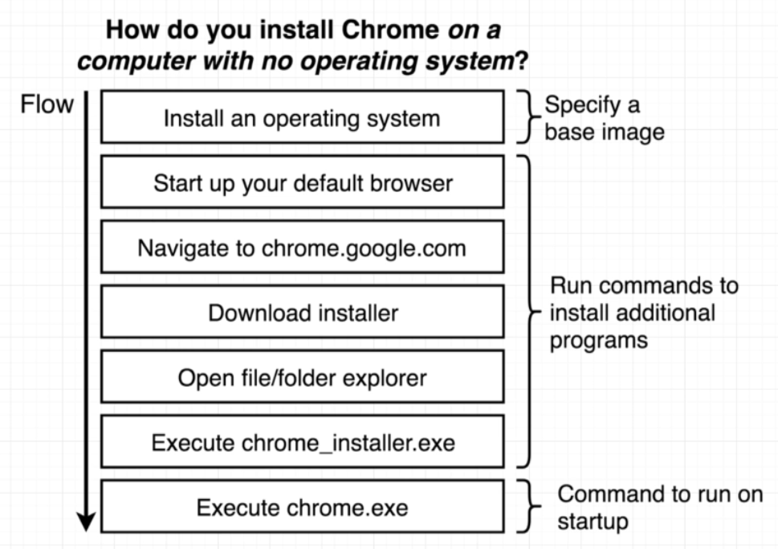

# Docker

Docker is an open source containerization platform.

- What is an **image**?

It is a single file with all the dependencies and configurations required to run a program. You can think of it as a **snapshot of the program (file system)** along with its **startup command**

- What exactly is a **container**?

A container is the instance of an image, whose sole purpose is to run one program. When you execute a docker run command, it takes the **snapshot of the program** inside the container and runs the **startup command**

## Commands

- **Creating** and **running** a container from an image - `docker run <image-name>`

- A variation of docker run that lets you **override the default startup command** - `docker run <image-name> command`

**NOTE**: The command should be based on the FS Snapshot, if it doesnt exist then it will throw an error
  

- Only **create the container** without executing the startup command - `docker create <image-name>`

- **Start the container** created - `docker start image-id`

- **Start the container** created and **output the logs** - `docker start -a image-id`

- Execute commands inside running containers - `docker exec -it <container-id> <command>`
  
**NOTE**: The **-it flag** is a combination of two flags **-i** and **-t**. The **-i flag** connects the **command to execute** with the **linux standard input output**. The **-t flag** prettifies the input and output.

- Start **shell** when **container is run** - `docker run -it <image-name> sh`

- List all running containers - `docker ps`

- List all containers that have ever been created - `docker ps --all`

- **Removing all** stopped containers - `docker system prune`

- Get **logs from a container** - `docker logs <container-id>`

- **Stopping** containers - `docker stop <container-id>` OR `docker kill <container-id>`

### Container Additional Info

Creating a container and Running (Starting) are actually 2 different processes

## Creating Docker Images

Till now we have seen how to pull and run images created by other engineers. How do we **create our own docker image**? **Dockerfile**

Every Dockerfile that we create will almost always have the same flow

- To **build a Docker image** - `docker build .`

Now, what exactly is a base image? Before we get to that, let's understand what exactly is writing a Dockerfile

**IMPORTANT**

What happens when you **build an image**. If you notice the out put of the build command, after each step there will be an **image ID output** and **removing intermediate container** output.

This means, at each step, a **temporary container** is created.

The **base image FS is copied inside the temporary container**, **saves the image ID**, runs the next command, **copies the updated FS to the temp container**, runs the next command.

### Building from cache

Once Dockerfile build completes, the next time you run the build command, it would execute pretty quickly as it would build it from cache.

Whenever you make a change to the Dockerfile, it will **rebuild every command below that new change**. So the **order of commands** matter in the Dockerfile

## Know more

- When you install the docker client on Windows or MacOS, it actually **installs linux in a VM** and runs it on that

- **No two containers** have the same file system and there is **no data sharing** between the two
