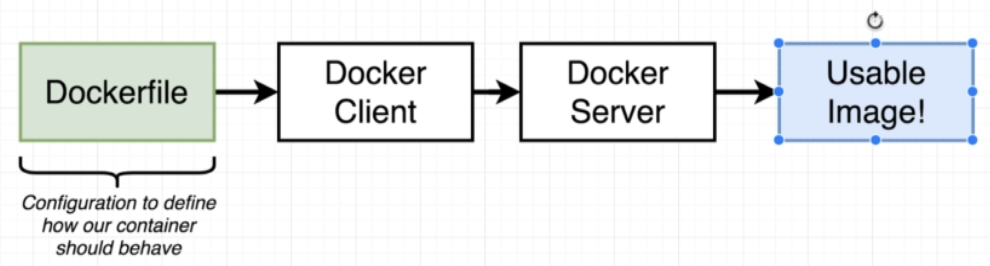

# Docker

Docker is an open source containerization platform.

- What is an **image**?

It is a single file with all the dependencies and configurations required to run a program. You can think of it as a **snapshot of the program (file system)** along with its **startup command**

- What exactly is a **container**?

A container is the instance of an image, whose sole purpose is to run one program. When you execute a docker run command, it takes the **snapshot of the program** inside the container and runs the **startup command**

## Commands

- **Creating** and **running** a container from an image - `docker run <image-name>`

- A variation of docker run that lets you **override the default startup command** - `docker run <image-name> command`

**NOTE**: The command should be based on the FS Snapshot, if it doesnt exist then it will throw an error
  

- Only **create the container** without executing the startup command - `docker create <image-name>`

- **Start the container** created - `docker start image-id`

- **Start the container** created and **output the logs** - `docker start -a image-id`

- Execute commands inside running containers - `docker exec -it <container-id> <command>`
  
**NOTE**: The **-it flag** is a combination of two flags **-i** and **-t**. The **-i flag** connects the **command to execute** with the **linux standard input output**. The **-t flag** prettifies the input and output.

- Start **shell** when **container is run** - `docker run -it <image-name> sh`

- List all running containers - `docker ps`

- List all containers that have ever been created - `docker ps --all`

- **Removing all** stopped containers - `docker system prune`

- Get **logs from a container** - `docker logs <container-id>`

- **Stopping** containers - `docker stop <container-id>` OR `docker kill <container-id>`

### Container Additional Info

Creating a container and Running (Starting) are actually 2 different processes

## Creating Docker Images

Till now we have seen how to pull and run images created by other engineers. How do we **create our own docker image**? **Dockerfile**

Every Dockerfile that we create will almost always have the same flow

- To **build a Docker image** - `docker build .`

Now, what exactly is a base image? Before we get to that, let's understand what exactly is writing a Dockerfile

**IMPORTANT**

What happens when you **build an image**. If you notice the out put of the build command, after each step there will be an **image ID output** and **removing intermediate container** output.

This means, at each step, a **temporary container** is created.

The **base image FS is copied inside the temporary container**, **saves the image ID**, runs the next command, **copies the updated FS to the temp container**, runs the next command.

### Building from cache

Once Dockerfile build completes, the next time you run the build command, it would execute pretty quickly as it would build it from cache.

Whenever you make a change to the Dockerfile, it will **rebuild every command below that new change**. So the **order of commands** matter in the Dockerfile

### Tagging an image

Running the image using its ID is not so efficient. We can tag the image while running the build command - `docker build -t dPacman/redis:latest .`

Naming convention of the tag is as below

### Copying Build Files

- To copy build files from your machine into the docker container, add this inside the Dockerfile: `COPY ./ ./`

### Container Port Forwarding

Let's assume that we are running our custom build image of a express server on port 8080. If we were to try accessing it on the browser, we wont be able to.

In order to **route any request coming from outside the containers network**, we have to set up an explicit **port mapping or forwarding**.

**NOTE** - This is only for incoming requests to the container, the container can by default make requests to the outside world

We do not set up the port forwarding in the Dockerfile configuration. It is a run time constraint.

- The command is: `docker run -p 8080 : 8080 <image-id>`

### Specifying a Working Directory

If we don't specify a working directory, the folders inside our app might conflict with default folder names in the image root directory. For example, "lib".

To solve this problem, we can add the `WORKDIR` command in the Dockerfile

## Know more

- When you install the docker client on Windows or MacOS, it actually **installs linux in a VM** and runs it on that

- **No two containers** have the same file system and there is **no data sharing** between the two
