# Kubernetes

Kubernetes is a tool for running a bunch of different containers. We give it some configuration to describe how we want our containers to run and interact with each other

## Setup

- **Minikube**: If you are running Docker on Windows/Mac, the installation is simple. If you are running Docker on Linux, you need to install **Minikube** (<https://minikube.sigs.k8s.io/docs/start/>).

- **Kubectl**: Install **Kubectl** (<https://kubernetes.io/docs/tasks/tools/install-kubectl-linux/>)

- Kubectl is how we interact with the Kubernetes cluster.

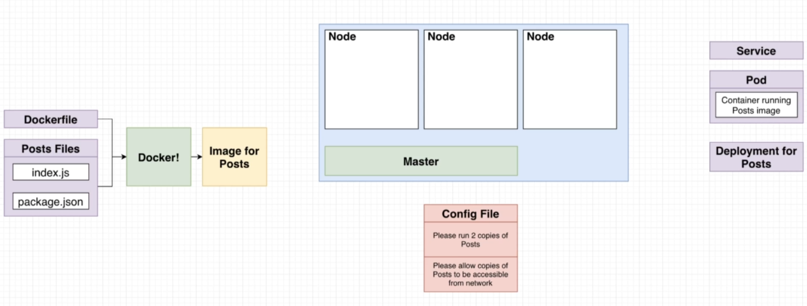

### Terminologies

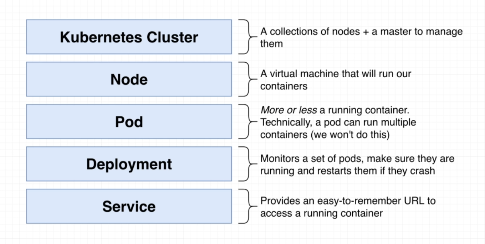

### Configuring the cluster

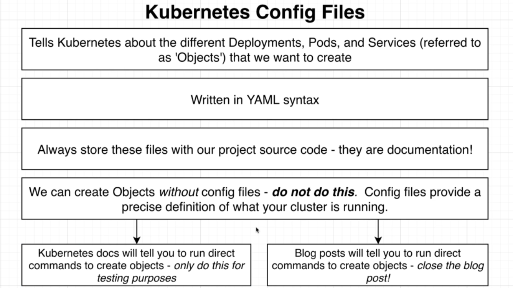

### YAML File Breakdown

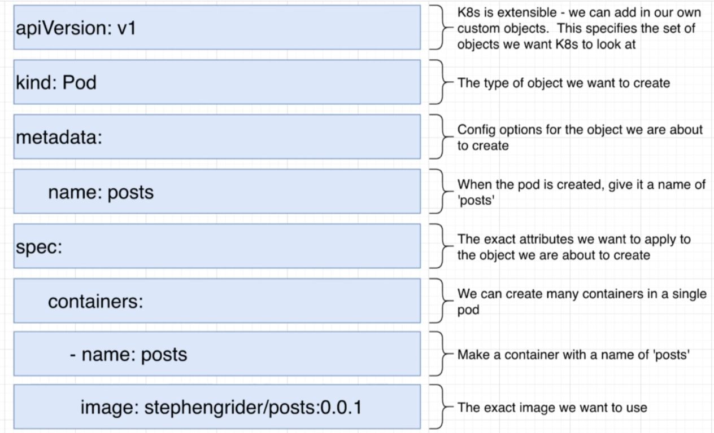

## Commands

**Minikube**

- To start Minikube: `minikube start`

- To stop Minikube: `minikube stop`

- To open Minikube dashboard: `minikube dashboard`

- To apply the configuration: `kubectl apply -f <file-name.yaml>`

- To apply changed config: `kubectl apply -f <file-name.yaml>`
  
**Pods**

- To get status of all running pods: `kubectl get pods`
  
- To describe a particular pod: `kubectl describe pod <pod-name>`

- To delete a pod: `kubectl delete pod <pod-name>`

- To get logs of pod: `kubectl logs <pod-name>`

**Deployments**

- To get status of all running deployments: `kubectl get deployments`

- To describe a particular deployment: `kubectl describe deployment <deployment-name>`

- To delete a deployment: `kubectl delete deployment <deployment-name>`

- To get logs of deployment: `kubectl logs <deployment-name>`

- **Updating** deployment: `kubectl rollout restart deployment <deployment-name>`

**Services**

- To apply a service configuration: `kubectl apply -f <service-name.yaml>`

- To get status of all running services: `kubectl get services`

- To describe a particular service: `kubectl describe service <service-name>`

## Networking

Now that we are familiar with the configurations and deployment, how do we **access the server** that's running inside the pod? **Services**

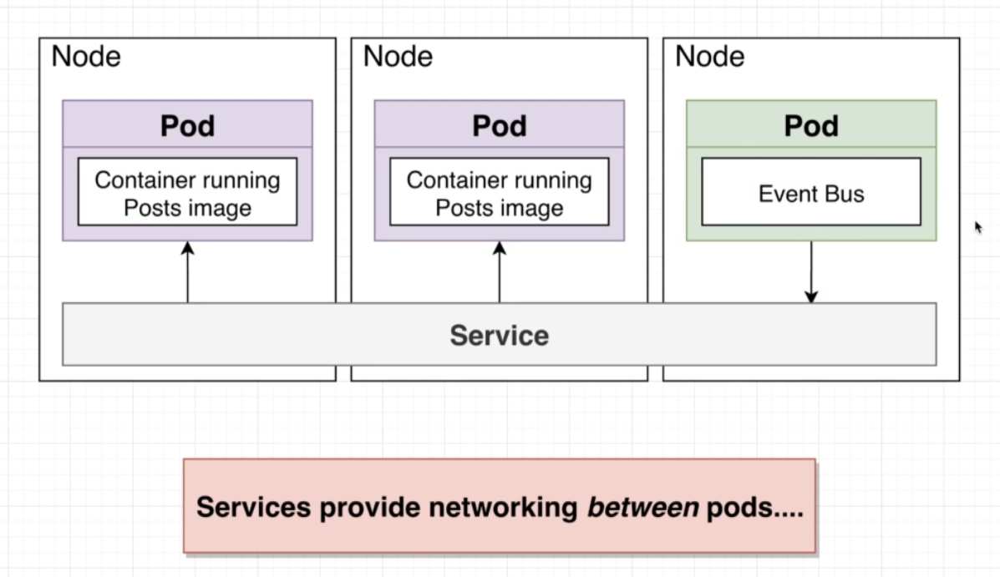

A service is another **kind of object in kubernetes**. We create services using config files. We are going to **use services to set up communication between all of the different pods (Cluster IP)**, or to **get access to a pod from the outside of our cluster (if dev ? Node Port : Load Balancer)**.

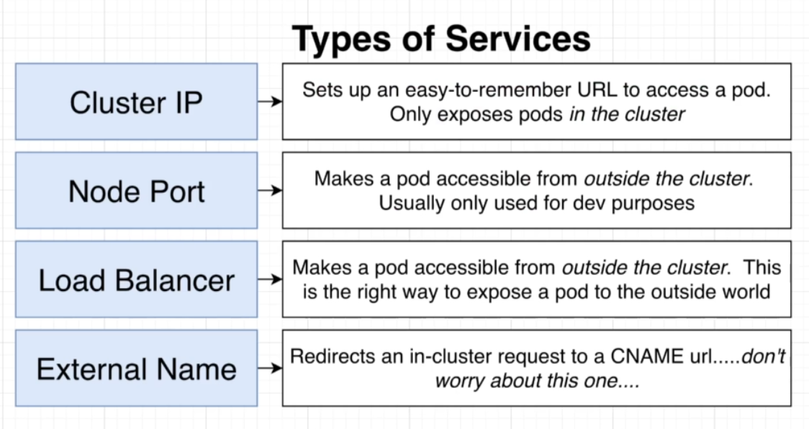

## Load Balancer

For every deployment we create, we could create a NodePort service to expose the end-point to the client. But, that's **not the best way to do it** as we would expose the IP of our containers.

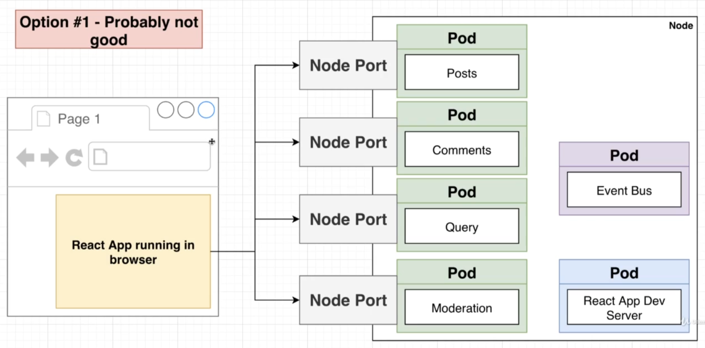

A better way would be to use a **Load Balancer Service**.

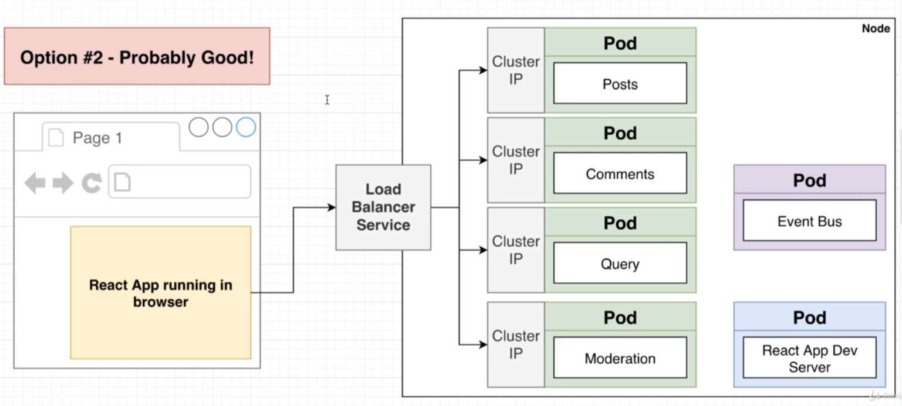

#### Load Balancer Terminologies

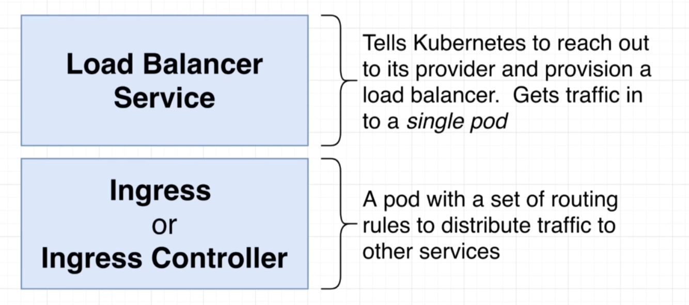

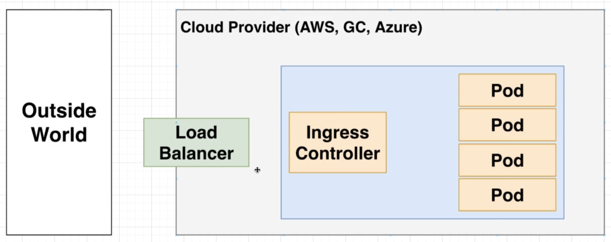

#### Installing Ingress-Nginx

Refer the URL: <https://kubernetes.github.io/ingress-nginx/deploy/>

- To enable Ingress-Nginx on Minikube - `minikube addons enable ingress

- To verify installation - `kubectl get pods -n ingress-nginx -l app.kubernetes.io/name=ingress-nginx --watch`

Now we need to teach the Ingress controller some routing rules on how to take appropriate requests and send them to the appropriate pods.

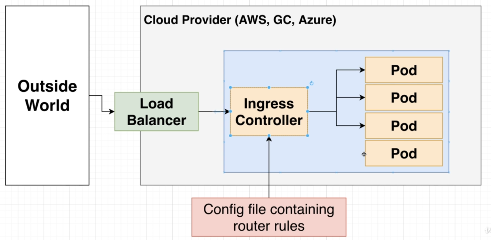

In the `ingress-srv.yaml`, under **spec**, we defined a **host**. We can have multiple domains within each Kubernetes cluster and the host property defines it.

When we are developing, lets say if the host was posts.com, we would want to trick our computer to route to the cluster posts.com and not the actual posts.com. To do this, we need to modify out `/etc/hosts` file on Linux.

In the `/etc/hosts` file add the following -
`{Output of minikube ip} posts.com`

Now, if you visit the posts.com on your browser, it will open our posts service instead. Behind the scenes, ingress-nginx is going to the take this request and route it to the appropriate service and the service will route it to the appropriate pod.

**NOTE** - What we did here by modifying the hosts file is appropriate only for a dev environment. When we actually deploy it, we dont have to make any actual changes to any hosts file, we will be connecting to the real posts.com which will connect it to the kubernetes cluster.
